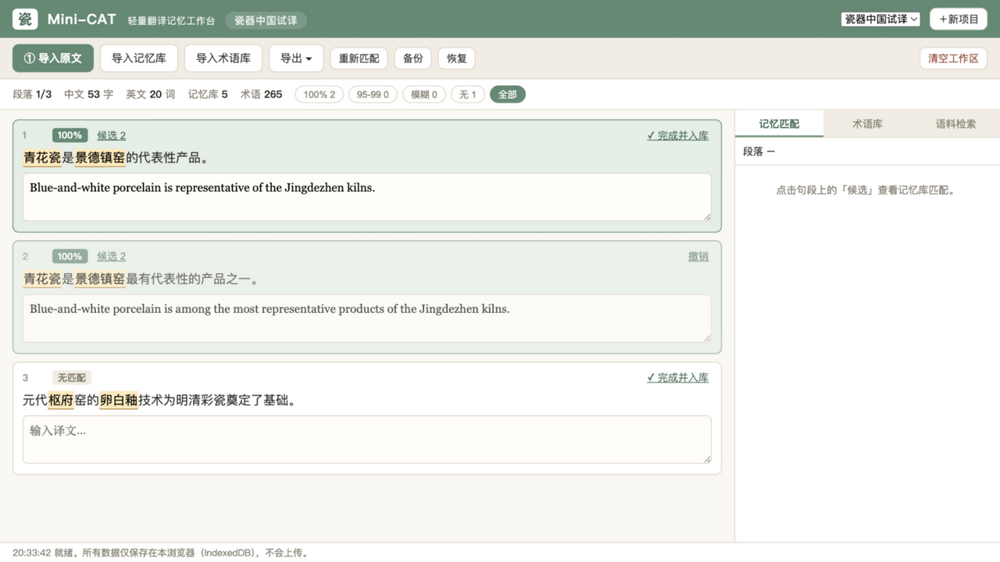

# Mini-CAT · 轻量翻译记忆工作台

**Lightweight browser-based CAT tool — translation memory + termbase + fuzzy matching, zero dependencies, data never leaves your machine.**

一个给自己用的"迷你 Trados / memoQ"：导入已有的试译内容与术语表，建立翻译记忆库；新翻译的内容自动匹配记忆库与术语库。专为 10 万字以内的个人翻译项目设计（当前项目约 3.5 万字，个人部分约 1.2 万字）。



> 🔗 **在线使用（零后端，数据不出浏览器）**：<https://tanyaqiong31029.github.io/mini-cat/>

## 为什么不用现成工具

| | Trados / memoQ | MateCat / Weblate | **Mini-CAT** |
|---|---|---|---|
| 安装 | 重型桌面软件 | 需自建服务器（PHP/MySQL、Django） | **双击网页即用** |
| 数据 | 本地/云 | 上传到服务器 | **全在本机浏览器（IndexedDB）** |
| 适用规模 | 大型项目 | 持续本地化 | **≤10 万字个人项目** |
| 费用 | 商业授权 | 开源但运维成本 | **零依赖、零成本** |

对未出版书稿的翻译来说，"内容不出本机"是硬需求——Mini-CAT 没有任何后端、没有任何网络请求，全部逻辑与数据都在浏览器里。

## 功能

- **记忆库（TM）**：导入 **TMX 1.4 / docx 对照表 / xlsx 双语表** / CSV / TSV / JSONL / 双栏粘贴（自动段落对齐）；导出 TMX / CSV / JSONL，可回流 Trados、memoQ 或语料库仓库
- **ICE 101% 上下文匹配**：前一句也精确命中时升级为 101% 并优先自动填入（memoQ/Trados 惯例）
- **端侧 MT 建议（实验）**：Chrome 138+ 内置翻译 API，模型在本机运行、文本不上传；不支持的浏览器自动隐藏按钮
- **术语库（TB）**：导入 **xlsx** / TBX-Basic / CSV / TSV（自动识别"中文术语/最终译法"等列）；译文写作时在原文中**高亮命中术语**，悬停显示译法与定义；导出 TBX / CSV
- **Word 文档直接导入**：单语 docx（如翻译底本）自动提取段落切分；双语 docx 支持左右对照表格、段落交替、先中后英三种结构（自动检测 + 手动指定）
- **审校留痕（多人协作）**：修订历史（V1 谭雅琼 → V2 刘小婷 → …）、**导入修订**（审校人改完的双语文件按中文原文自动匹配，识别有修订/无变化/新增）、**批注模块**（多人署名）；导出 **Word 原生修订模式**（删除线/下划线+修订人署名，审阅窗格直接处理）、Word 批注、修订对照表（xlsx/csv）——审校过程完整可追溯
- **联网术语查阅**：侧栏输入关键词，自动聚合中文/英文维基百科、大都会艺术博物馆藏名（馆方高亮优先）、Internet Archive 书目；一键直达术语在线（全国科技名词委）、故宫数字文物库、Google Scholar 等权威库。**任何候选译名都须经人工点击"设为英文译法"才写入术语库**（自动标注来源与日期）——依据国社科申报要求，工具不自动生成译文
- **自动匹配**：新原文按句切分后自动匹配——100% 精确匹配直接填入译文，模糊匹配（95–99 / 75–94 / 50–74%）在候选面板中一键采用
- **语料检索（Concordance）**：在全部记忆库中按关键词检索中英对照用例
- **译后自动入库**：段落确认后自动写入记忆库（memoQ 式自动学习），重复句对自动去重
- **交付导出（范围可选）**：**纯译文**（按原文段落自动重建，docx/txt）、**中英对照·段落式**（docx，中文段+斜体英文段）、**句句对照表格**（docx/xlsx/csv，「序号｜中文｜英文」三列，与项目交付件同款）——另附双语 HTML 对照表
- **项目统计**：段落进度、中英字/词数、匹配率分布（101/100/95-99/模糊/无）——写翻译实践报告时的过程数据直接可用
- **多项目**：按项目隔离记忆库与术语库；JSON 全量备份/恢复，**拖拽 .json 到页面即可恢复**，超过 7 天未备份自动提醒

## 快速开始

**方式一（最简单）**：下载本仓库，双击 `index.html`。

**方式二（GitHub Pages，推荐）**：直接访问 <https://tanyaqiong31029.github.io/mini-cat/>——本仓库已开启 Pages，点开即用。fork 后请在 Settings → Pages 选 main 分支根目录自行开启。

**方式三（本地服务器）**：

```bash
python3 -m http.server 8765
# 打开 http://127.0.0.1:8765
```

第一次使用：① 导入记忆库（可直接用 `sample/sample_tm.tmx` 体验）→ ② 导入术语库（`sample/sample_termbase.csv`）→ ③ 导入原文（粘贴中文即可）→ 开始翻译。确认段落时译文自动入库。

### 与 porcelain-china-corpus 无缝衔接

本工具按该语料库仓库的文件格式设计：`corpus/parallel/porcelain_zh_en.tmx|csv|jsonl` 直接导入记忆库，`termbase/porcelain_termbase.csv|tbx` 直接导入术语库（自动取"2026最终译法"，空缺回退"2025英文译法"）；导出的 TMX/JSONL/TBX 可直接回流仓库。

## 匹配算法

借鉴 OmegaT（编辑距离相似度）与 MateCat（匹配分级）的通行做法：

1. **归一化**：全半角统一、空白折叠、大小写归一；中文再去空格
2. **候选海选**：字符 bigram 倒排索引，按共享比例取前 120 条（避免全库两两比对）
3. **粗筛**：长度比 < 0.34 或 bigram Dice 系数 < 0.18 直接排除
4. **精算**：有界 Levenshtein 归一化编辑距离（提前放弃），标点差异轻罚
5. **分级**：100%（精确）/ 95–99 / 75–94 / 50–74（模糊）/ 无

实测规模：4,000 条记忆 × 400 段新原文 ≈ 2 秒（见 `tests/bench.js`）。ICE（101%）判定：记忆条目记录前一句语境（prevNorm），新段落的前文与其一致时，精确匹配升级为 101% 并优先自动填入。

## 隐私与备份边界

- 无后端、无账号、无埋点；数据仅存于本机浏览器 IndexedDB
- 清除浏览器数据会删除记忆库——**定期用「备份」导出 JSON**（工具在超过 7 天未备份时会提醒）
- 备份 JSON 含全部翻译记忆与术语，**请视为敏感数据妥善保管**；恢复时与现有数据合并去重，外来记录 ID 一律丢弃、结构经消毒校验（防跨库覆盖与注入）
- 换电脑/换浏览器：备份 JSON 拖拽进页面即完成迁移

## 开发

零依赖、无构建步骤；`js/core.js`（纯函数核心）与 `js/io.js`（格式解析）可在 Node 中直接测试：

```bash
node tests/core.test.js    # 24 项单元测试（匹配/分段/CSV）
node tests/msoffice.test.js # 14 项测试（ZIP 解包 + ICE 匹配）
node tests/bench.js        # 规模基准
```

架构与设计取舍见 [docs/architecture.md](docs/architecture.md)。

## 已知限制（v1.1）

- .xls（旧二进制格式）不支持，请另存为 .xlsx；旧版浏览器（无 DecompressionStream）读取 docx/xlsx 需 Chrome/Edge 80+、Safari 16.4+
- 端侧 MT 建议仅在 Chrome 138+ 且本机有 zh→en 语言包时可用，其他浏览器自动隐藏（不影响其余功能）
- 数据存于浏览器 IndexedDB：换电脑或换浏览器用「备份」导出 JSON，在新机器拖拽进页面即完成迁移

MIT License.
